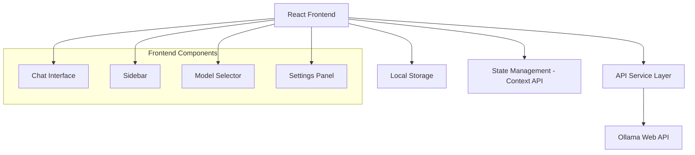

# Design Document

## Overview

The Ollama Frontend is a React-based web application that provides an intuitive interface for interacting with Ollama language models. The application follows a modern chat interface pattern with a sidebar for conversation management and a main chat area for model interactions. The design emphasizes real-time communication, responsive layout, and extensible architecture to support future enhancements.

## Architecture

### High-Level Architecture



### Technology Stack

- **Frontend Framework:** React 18 with TypeScript
- **Styling:** Tailwind CSS for responsive design and theming
- **State Management:** React Context API with useReducer for complex state
- **HTTP Client:** Axios for API communication with interceptors
- **Build Tool:** Vite for fast development and optimized builds
- **Icons:** Lucide React for consistent iconography

### Folder Structure

```
src/
├── components/
│   ├── chat/
│   │   ├── ChatInterface.tsx
│   │   ├── MessageBubble.tsx
│   │   └── MessageInput.tsx
│   ├── sidebar/
│   │   ├── Sidebar.tsx
│   │   ├── ConversationList.tsx
│   │   └── ModelSelector.tsx
│   ├── ui/
│   │   ├── Button.tsx
│   │   ├── Input.tsx
│   │   └── LoadingSpinner.tsx
│   └── layout/
│       └── AppLayout.tsx
├── contexts/
│   ├── AppContext.tsx
│   ├── ChatContext.tsx
│   └── ThemeContext.tsx
├── services/
│   ├── api.ts
│   ├── ollamaService.ts
│   └── storageService.ts
├── types/
│   ├── chat.ts
│   ├── model.ts
│   └── api.ts
├── hooks/
│   ├── useChat.ts
│   ├── useModels.ts
│   └── useLocalStorage.ts
└── utils/
    ├── constants.ts
    └── helpers.ts
```

## Components and Interfaces

### Core Components

#### 1. AppLayout Component
- **Purpose:** Main layout wrapper with responsive sidebar and chat area
- **Props:** None (uses context for state)
- **Responsibilities:**
  - Responsive layout management
  - Theme application
  - Global error boundary

#### 2. ChatInterface Component
- **Purpose:** Main chat area displaying messages and input
- **Props:** `conversationId: string`
- **Responsibilities:**
  - Message rendering with proper formatting
  - Real-time message updates
  - Scroll management for long conversations
  - Loading states during API calls

#### 3. Sidebar Component
- **Purpose:** Navigation and conversation management
- **Props:** None (uses context)
- **Responsibilities:**
  - Conversation list display
  - Model selection interface
  - Training status indicator
  - Settings access

#### 4. MessageBubble Component
- **Purpose:** Individual message display with user/assistant styling
- **Props:** `message: Message, isUser: boolean`
- **Responsibilities:**
  - Message content rendering
  - Timestamp display
  - Copy message functionality

### API Service Layer

#### OllamaService Interface
```typescript
interface OllamaService {
  // Chat operations
  sendMessage(model: string, message: string, conversationId: string): Promise<string>
  streamMessage(model: string, message: string, onChunk: (chunk: string) => void): Promise<void>
  
  // Model management
  getAvailableModels(): Promise<Model[]>
  getModelInfo(modelName: string): Promise<ModelInfo>
  
  // Training status
  getTrainingStatus(): Promise<TrainingStatus>
  
  // Health check
  checkConnection(): Promise<boolean>
}
```

### State Management

#### Chat Context Structure
```typescript
interface ChatState {
  conversations: Conversation[]
  activeConversationId: string | null
  selectedModel: string | null
  isLoading: boolean
  error: string | null
}

interface ChatActions {
  createConversation: () => void
  selectConversation: (id: string) => void
  deleteConversation: (id: string) => void
  sendMessage: (message: string) => Promise<void>
  setSelectedModel: (model: string) => void
  clearError: () => void
}
```

## Data Models

### Core Data Types

```typescript
interface Message {
  id: string
  content: string
  role: 'user' | 'assistant'
  timestamp: Date
  conversationId: string
}

interface Conversation {
  id: string
  title: string
  messages: Message[]
  model: string
  createdAt: Date
  updatedAt: Date
}

interface Model {
  name: string
  size: string
  modified: Date
  digest: string
  details?: {
    format: string
    family: string
    families: string[]
    parameter_size: string
    quantization_level: string
  }
}

interface TrainingStatus {
  isTraining: boolean
  currentModel?: string
  progress?: number
  eta?: string
  error?: string
}
```

### Local Storage Schema

```typescript
interface StoredData {
  conversations: Conversation[]
  preferences: {
    theme: 'light' | 'dark'
    selectedModel: string
    sidebarCollapsed: boolean
  }
  apiConfig: {
    baseUrl: string
    timeout: number
  }
}
```

## Error Handling

### Error Categories

1. **Network Errors**
   - Connection timeout
   - Server unavailable
   - Invalid API endpoint

2. **API Errors**
   - Model not found
   - Invalid request format
   - Rate limiting

3. **Application Errors**
   - Invalid conversation state
   - Local storage corruption
   - Component rendering errors

### Error Handling Strategy

- **Global Error Boundary:** Catches unhandled React errors
- **API Error Interceptor:** Standardizes API error responses
- **User-Friendly Messages:** Converts technical errors to actionable messages
- **Retry Logic:** Automatic retry for transient network errors
- **Fallback States:** Graceful degradation when features are unavailable

## Testing Strategy

### Unit Testing
- **Components:** React Testing Library for component behavior
- **Services:** Jest for API service logic
- **Hooks:** Custom hook testing with renderHook
- **Utilities:** Pure function testing

### Integration Testing
- **API Integration:** Mock Ollama API responses
- **State Management:** Context provider testing
- **User Flows:** End-to-end conversation scenarios

### E2E Testing
- **Critical Paths:** Chat flow, model selection, conversation management
- **Responsive Design:** Cross-device compatibility
- **Error Scenarios:** Network failures, API errors

### Performance Testing
- **Message Rendering:** Large conversation performance
- **Memory Usage:** Long-running session monitoring
- **API Response Times:** Network latency handling

## Responsive Design Strategy

### Breakpoints
- **Mobile:** < 768px (collapsed sidebar, full-screen chat)
- **Tablet:** 768px - 1024px (collapsible sidebar)
- **Desktop:** > 1024px (persistent sidebar)

### Mobile Optimizations
- Touch-friendly button sizes (minimum 44px)
- Swipe gestures for sidebar navigation
- Virtual keyboard handling for message input
- Optimized message bubble sizing

### Accessibility Features
- ARIA labels for screen readers
- Keyboard navigation support
- High contrast mode compatibility
- Focus management for modal dialogs

## Security Considerations

### Data Protection
- No sensitive data stored in localStorage
- API key handling through environment variables
- Input sanitization for user messages
- XSS prevention in message rendering

### API Security
- Request timeout configuration
- Rate limiting awareness
- Error message sanitization
- CORS handling for development/production